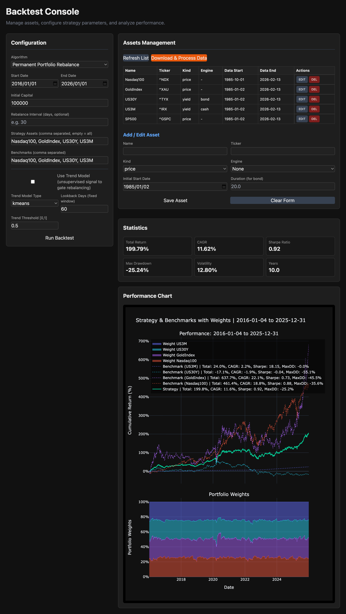

# Stock Trading Backtest System

A Python-based multi-asset backtesting system featuring automated data downloading, yield-to-price pricing engines, a core backtest engine with pluggable rebalancing algorithms, and an interactive FastAPI-based web console.

The system is designed for backtesting long-term asset allocation strategies (e.g., Permanent Portfolio) with support for arbitrary asset configurations.

---

<details>
<summary><strong>Updates</strong></summary>

- **2026-02-22**
  - Added a public template file for trend models so that users can more easily plug in their own models.
  - Adjusted internal subproject references to point to the latest data/code snapshot.
  - Cleaned up `.gitignore` rules so that `config/assets.json` is handled correctly and old file paths are no longer referenced.
- **2026-02-18**
  - Refactored the data loading and processing pipeline into clearer stages: incremental raw data download (per selected asset) and full-portfolio processing/alignment driven by configuration.
  - Introduced the `DataProcessor` class to centralize yield-to-price engines (bond/cash) and build a flexible multi-asset price matrix that only drops fully-empty dates, deferring final "barrel effect" trimming to the backtest layer.
  - Updated the FastAPI endpoints: `POST /api/assets/download` now strictly works on user-selected assets, while `POST /api/assets/process` always rebuilds `aligned_assets.csv` from all assets defined in `config/assets.json`, independent of UI selection.

- **2026-02-17**
  - Added UI controls for configuring an unsupervised trend model (model type, fixed lookback window, threshold) and wiring it through the backtest engine.
  - Introduced a new `signal_weighted_rebalance` algorithm option that tilts portfolio weights based on per-asset trend signals (implementation details remain private).
  - Enhanced the Performance Chart to display Total Return, CAGR, Sharpe Ratio, and Max Drawdown for both the strategy and all selected benchmarks.
  - Added a second subplot below the performance chart that shows the portfolio's asset weights over time as a stacked area plot.

</details>

---

## Project Structure

```text
project_root/
├── backend/
│   ├── api.py           # FastAPI implementation and interactive Web UI (/ui)
│   └── service.py       # Backtest service layer: Request/Result models and core orchestration
│
├── data/                # Raw asset data (CSV files named using sanitized asset names)
├── data_processed/
│   ├── aligned_assets.csv              # Global aligned price matrix (built from all configured assets)
│   └── backtest_results_*.html         # Interactive Plotly charts generated from backtest runs
│
├── data_loader/
│   ├── yahoo_downloader.py    # Incremental OHLCV downloader using yfinance
│   ├── akshare_downloader.py  # Incremental OHLCV downloader using akshare
│   └── data_processor.py      # Yield-to-price conversion and multi-asset alignment
│
├── strategies/
│   ├── backtest_engine.py      # Core simulation engine (Time loop + algorithm execution)
│   ├── trend_models_template.py  # A template for trend_models.py
│   └── algorithms_template.py  # A template for algorithms.py
│
├── utils/
│   ├── decorators.py        # Generic decorators (e.g., @retry)
│   └── tools.py             # Timezone and date utility functions
│
├── logs/app.log             # System runtime logs
├── logger.py                # Global logging configuration
├── main_download.py         # Entry point: Data synchronization and processing
├── main_backtest.py         # Entry point: CLI-based backtest execution
├── requirements.txt
└── README.md
```

---

## Module Functionality

### 1. `backend/`: API and Service Layer

#### `backend/service.py` (BacktestService Class)
- **Algorithm Management**: Automatically discovers rebalancing strategies from the `algorithms` module.
- **Job Execution**: Orchestrates the full backtest workflow, including path resolution, engine instantiation, and result aggregation.
- **Models**: Defines `BacktestConfig` and `BacktestResult` using Pydantic for robust data validation.

#### `backend/api.py` (APIManager Class)
- **Web Interface**: Provides an interactive dashboard at `/ui` using Tailwind CSS.
- **REST Endpoints**:
  - `GET /api/algorithms`: Lists available rebalancing strategies.
  - `GET /api/assets`: Retrieves configured assets and their local data availability.
  - `POST /api/assets`: Creates an asset configuration.
  - `PUT /api/assets/{name}`: Updates an asset configuration.
  - `DELETE /api/assets/{name}`: Deletes an asset configuration.
  - `POST /api/assets/download`: Incrementally downloads raw CSV data for selected assets (60s cooldown).
  - `POST /api/assets/process`: Processes and aligns data for all configured assets into `data_processed/aligned_assets.csv`.
  - `POST /api/backtest`: Executes backtest simulations synchronously.

---

### 2. `data_loader/`: ETL Pipeline

#### `data_loader/yahoo_downloader.py` (YahooIncrementalLoader Class)
- **Incremental Sync**: Each asset is stored as `data/<sanitized_name>.csv`. The downloader reads local history and only requests the missing date range from Yahoo Finance.
- **Column Normalization**: Standardizes yfinance output into consistent OHLCV columns (`Open`, `High`, `Low`, `Close`, `Volume`) and fills common gaps (e.g., zero/NaN OHLC using `Close`).
- **Batch Mode**: `download_batch(assets, start_year=1985)` respects per-asset `initial_start_date` when provided, otherwise falls back to `start_year`.

#### `data_loader/data_processor.py` (DataProcessor Class)
- **Yield-to-Price Engines**:
  - `bond_pricing_engine`: Converts yield series into a synthetic total return price series (duration-based approximation).
  - `cash_pricing_engine`: Converts short-rate yields into a cash-like cumulative return series.
- **Alignment Strategy**:
  - Builds a multi-asset price matrix in-memory.
  - Drops only dates where *all* assets are missing (`dropna(how="all")`), preserving partial-missing dates.
  - Final date-range trimming for a specific backtest run is deferred to the backtest layer based on the selected asset subset.
- **Persistence**: `process_and_align(...)` writes the aligned matrix to `data_processed/aligned_assets.csv`.

---

## Installation

### 1. Create Virtual Environment (Recommended)

```bash
python -m venv .venv
source .venv/bin/activate  # Windows: .venv\Scripts\activate
```

### 2. Install Dependencies

```bash
pip install -r requirements.txt
```

---

## Usage Guide

### 1. Data Setup

1. Configure assets via Web UI (**Assets Management**) or by editing `config/assets.json`.
2. Download / update raw data:

   - Via Web UI:
     - Select assets in the Assets table and click **Download Data** (calls `POST /api/assets/download`).
   - Via CLI:

     ```bash
     python main_download.py
     ```

3. Process and align data:

   - Via Web UI:
     - Click **Process Data** to rebuild `data_processed/aligned_assets.csv` from all configured assets (calls `POST /api/assets/process`).

### 2. Running Simulations

```bash
mv strategies/algorithms_template.py strategies/algorithms.py
mv strategies/trend_models_template.py strategies/trend_models.py
```

#### Via CLI

```bash
python main_backtest.py
```

#### Via Web UI

1. Start the server:

   ```bash
   python backend/api.py
   ```

2. Navigate to `http://127.0.0.1:8000/ui`.
3. (Optional) Download / process data.
4. Configure parameters and click **Run Backtest**.



---

## FAQ

- **Rate Limiting**: The Yahoo Finance downloader is subject to API rate limits. The system implements a 60-second cooldown on the download endpoint.
- **Processing vs Selection**:
  - `Download Data` operates on selected assets.
  - `Process Data` always rebuilds `aligned_assets.csv` from *all* assets in `config/assets.json`.
- **Adding Algorithms**: New strategies can be added as static methods ending in `_rebalance` within `strategies/algorithms.py`. They will be automatically detected by the system.
